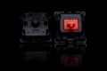
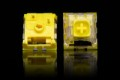
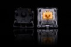
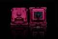
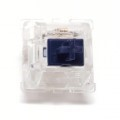

# Mechanical Switches
A list of mechanical switches. I made it to ensure that anyone can find them as easily as possible.

- Alps
- Big Switch
  - These switches are 4 times bigger on each side than a normal MX switch.
  - That comes up to 64 times bigger in volume.
  - These switches are fully functional.
  - All switches come with a matching keycap.
  - If you are in need of a Big Switch case, make sure to check out Strata KB for their selection!
- BSUN
- Cherry
- FEI
  - Designed by Chouyu, manufactured by Gateron.
- Gateron
- Greetech
- Kailh
- Matias
- MOD
- Outemu
- Topre
- TTC
- YOK
- ZealPC

|Name|Image|Type|Actuation Force|Bottoming Force|
|---|---|---|:---:|:---:|
|**Big Switch**|||||
|Pale Blue||Clicky|
|Dark Yellow||Linear|
|Burnt Orange||Tactile|
|**BSUN**|||||
|Black||Linear|||
|Blue||Clicky|||
|Brown||Tactile|||
|Red||Linear|||
|**CHERRY**|||||
|Hirose||Linear|55g|70g|
|MX Black||Linear|60g||
|MX Blue RGB Clear||Clicky|50g|60g|
|MX Blue||Clicky|50g|60g|
|MX Brown RGB Clear||Tactile|45g|55g|
|MX Brown||Tactile|45g|55g|
|MX Clear||Tactile|55g|95g|
|MX Gray||Tactile|80g||
|MX Green||Clicky|80g|105g|
|MX Red RGB Clear||Linear|45g||
|MX Red||Linear|45g||
|MX Silent Red RGB Clear||Linear|45g||
|MX Silent Red||Linear|45g||
|MX White||Clicky|55g|80g|
|**FEI**|||||
|FEI R2||Linear||62g|
|**Gateron**|||||
|Black||Linear|60g||
|Blue||Clicky|60g||
|Brown||Tactile|55g||
|Clear||Linear|35g||
|Milk Black||Linear|60g||
|Milk Blue||Clicky|60g||
|Milk Brown||Tactile|55g||
|Milk Clear||Linear|35g||
|Milk Green||Clicky|80g||
|Milk Red||Linear|45g||
|Milk Silent Black||Linear|60g||
|Milk Silent Brown||Tactile|55g||
|Milk Silent Red||Linear|45g||
|Milk Yellow||Linear|50g||
|Green||Clicky|||
|Ink Black||Linear|70g||
|Ink Blue||Clicky|60g||
|Ink Red||Linear|45g||
|Ink Silent Black||Linear|60g||
|Ink Yellow||Linear|67g||
|NovelKeys x Gateron Glow||Linear|50g||
|Red||Linear|45g||
|Silent Black||Linear|60g||
|Silent Brown||Tactile|55g||
|Silent Clear||Linear|35g||
|Silent Red||Linear|45g||
|Silent Yellow||Linear|50g||
|Yellow||Linear|50g||
|**Greetech**|||||
|Black||Linear|80g||
|Blue||Clicky|55g||
|Brown||Tactile|55g||
|Green||Clicky|80g||
|Red||Linear|55g||
|**Kailh**|||||
|Black|||||
|Blue|||||
|BOX Ancient Grey|||||
|BOX Black|||||
|BOX Brown|||||
|BOX Chinese Red|||||
|BOX Glazed Green|||||
|BOX Noble Yellow|||||
|BOX Red|||||
|BOX White|||||
|BOX Glazed Green|||||
|Brown|||||
|Choc Brown|||||
|Choc Red|||||
|Choc White|||||
|**Matias**|||||
|Linear||Linear|||
|Quiet|||||
|Standard|||||
|**MOD**|||||
|H||Linear|62g|78g|
|H||Tactile|62g|78g|
|L||Linear|45g|62g|
|L||Tactile|45g|62g|
|M||Linear|55g|68g|
|M||Tactile|55g|68g|
|**Outemu**|||||
|Black|||||
|Blue|||||
|Brown|||||
|Red|||||
|**TTC**|||||
|Gold Brown||Tactile|50g|60g|
|Gold Red||Linear|50g|65g|
|**YOK**|||||
|Mint Panda||Linear|50g|60g|
|Polar Panda||Linear|50g|60g|
|Purple Trash Panda||Tactile|67g|70g|
|Red Panda||Linear|50g|60g|
|Trash Panda||Linear|50g|60g|
|**ZealPC**|||||
|Aliaz||Tactile|60g||
|Aliaz||Tactile|70g||
|Aliaz||Tactile|80g||
|Aliaz||Tactile|100g||
|Healios V2||Linear|67g||
|Roselios||Linear|67g||
|Sakurios||Linear|62g||
|Zealios V2||Tactile|62g||
|Zealios V2||Tactile|65g||
|Zealios V2||Tactile|67g||
|Zealios V2||Tactile|78g||
|Zilents V2||Linear|62g||
|Zilents V2||Linear|65g||
|Zilents V2||Linear|67g||
|Zilents V2||Linear|78g||
